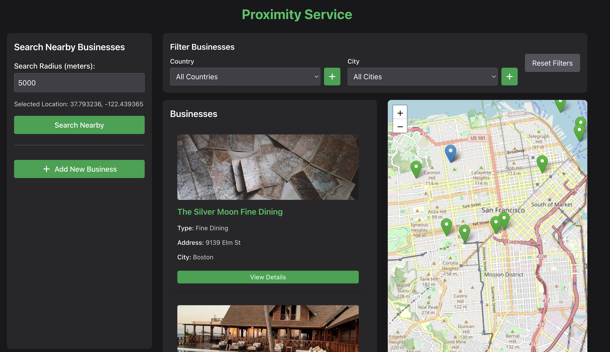

# Proximity Service

## Application Preview



The screenshot above demonstrates the main interface of the Proximity Service application:

- **Left Panel**: Search controls allowing users to specify a radius and search for nearby businesses
- **Center Panel**: List of businesses with details including name, type, address, and city
- **Right Panel**: Interactive map showing business locations (green markers) and selected location (blue marker)
- **Filter Controls**: At the top, users can filter businesses by country and city

This repository contains a full-stack application for finding nearby businesses using a spatial indexing algorithm. The application consists of a Deno backend and a React frontend, with a powerful QuadTree implementation for efficient spatial queries.

## Table of Contents

- [Overview](#overview)
- [Backend](#backend)
- [Frontend](#frontend)
- [QuadTree Algorithm](#quadtree-algorithm)
- [Features](#features)
- [Getting Started](#getting-started)
- [API Documentation](#api-documentation)

## Overview

Proximity Service is a location-based service that allows users to find businesses near a specific location. It uses a QuadTree data structure for efficient spatial queries, making it possible to quickly find businesses within a specified radius.

## Backend

The backend is built with Deno, a secure JavaScript and TypeScript runtime, and uses the following technologies:

- **Deno**: A secure runtime for JavaScript and TypeScript
- **Oak**: A middleware framework for Deno's HTTP server
- **SQLite3**: A lightweight, file-based database
- **QuadTree**: A custom implementation for spatial indexing

### Backend Structure

- `/backend/server.ts`: Main entry point for the server
- `/backend/src/db/database.ts`: Database initialization and queries
- `/backend/src/models/QuadTree.ts`: QuadTree implementation for spatial indexing
- `/backend/src/routes/`: API routes for businesses, cities, and countries
- `/backend/src/scripts/`: Utility scripts for seeding data
- `/backend/src/utils/`: Utility functions for geospatial calculations

### API Endpoints

- **Business API**:
  - `POST /api/business`: Add a new business
  - `GET /api/businesses`: Get all businesses
  - `GET /v1/search/nearby`: Find businesses near a location

- **Location API**:
  - `GET /api/countries`: Get all countries
  - `GET /api/countries/:id`: Get a country by ID
  - `POST /api/countries`: Add a new country
  - `GET /api/cities`: Get all cities
  - `GET /api/cities/:id`: Get a city by ID
  - `POST /api/cities`: Add a new city

## Frontend

The frontend is built with React and Vite, providing a modern and responsive user interface for interacting with the backend services.

### Frontend Structure

- `/frontend-vite/src/App.tsx`: Main application component
- `/frontend-vite/src/components/`: UI components
  - `BusinessList.tsx`: Displays a list of businesses
  - `MapComponent.tsx`: Interactive map for visualizing businesses
  - `FilterComponent.tsx`: Filters for businesses by city and country
  - `AddBusinessModal.tsx`: Modal for adding new businesses
  - `CityModal.tsx` and `CountryModal.tsx`: Modals for adding cities and countries
- `/frontend-vite/src/types.ts`: TypeScript type definitions

### Features

- Interactive map for visualizing businesses
- Filtering businesses by city and country
- Adding new businesses, cities, and countries
- Searching for businesses near a specific location
- Responsive design for desktop and mobile

## QuadTree Algorithm

The QuadTree algorithm is a tree data structure used for partitioning a two-dimensional space by recursively subdividing it into four quadrants. This makes it efficient for spatial queries like finding points within a specific area.

### How QuadTree Works

1. **Initialization**: The QuadTree is initialized with a boundary (min/max coordinates) and a capacity (maximum number of points per node).

2. **Insertion**: When a point is inserted, the algorithm:
   - Checks if the point is within the boundary
   - If the node has capacity, adds the point to the node
   - If the node is at capacity, subdivides into four quadrants and redistributes points

3. **Querying**: When querying for points within a range, the algorithm:
   - Checks if the range intersects with the node's boundary
   - If it does, checks all points in the node that fall within the range
   - Recursively checks all child quadrants that intersect with the range

### Advantages

- **Efficiency**: O(log n) time complexity for insertion and queries in average cases
- **Spatial Awareness**: Optimized for 2D spatial data
- **Memory Efficiency**: Only subdivides areas with high point density

## Getting Started

### Prerequisites

- Deno (v1.x or higher)
- Node.js (v14.x or higher)
- npm or yarn

### Backend Setup

```bash
# Clone the repository
git clone https://github.com/yourusername/proximity-service.git
cd proximity-service/backend

# Start the server
deno task start

# Seed the database with sample data
curl -X POST http://localhost:8000/admin/seed/locations
curl -X POST http://localhost:8000/admin/seed/businesses
```

### Frontend Setup

```bash
# Navigate to the frontend directory
cd ../frontend-vite

# Install dependencies
npm install

# Start the development server
npm run dev
```

## API Documentation

### Search Nearby Businesses

```
GET /v1/search/nearby?latitude=37.7749&longitude=-122.4194&radius=5000
```

Parameters:

- `latitude`: Latitude of the center point
- `longitude`: Longitude of the center point
- `radius`: Search radius in meters (default: 5000)

Response:

```json
{
  "total": 10,
  "businesses": [
    {
      "id": 1,
      "name": "Business Name",
      "type": "Restaurant",
      "address": "123 Main St",
      "city": "San Francisco",
      "state": "CA",
      "country": "United States",
      "latitude": 37.7749,
      "longitude": -122.4194,
      "distance": 0
    },
    ...
  ]
}
```

---

This project demonstrates the power of spatial indexing algorithms for location-based services, providing a complete solution for finding nearby businesses with efficient querying capabilities.
